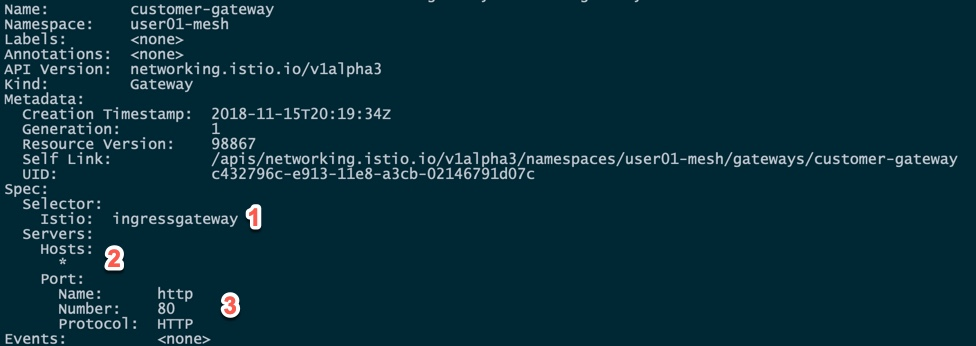
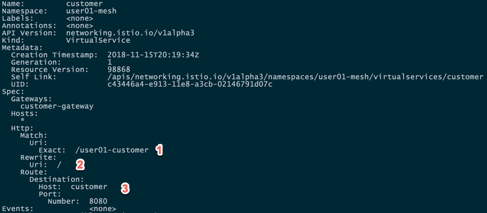

= Deploy Microservices
include::_attributes.adoc[]

[#deploycustomer]
== Deploy customer

Make sure you are logged in to OpenShift

[source,bash]
----
oc whoami
----

If not, please login to the lab OpenShift with your provided user

[source,bash]
----
oc login $LAB_HOST -u $USER
----

Once logged in, you should see 2 projects:

[source,bash]
----
oc get projects

NAME           DISPLAY NAME            STATUS
istio-system                           Active
user01-mesh    User 01 istio project   Active
----

istio-system is the namespace for the ISTIO control plane. You have readonly access to this project

userXX-mesh is the project you will use to do the lab. Select that project:

[source,bash]
----
oc project userXX-mesh
----

Deploy the Customer microservice using the following commands:

[source,bash]
----
cd ${LAB_HOME}

oc create -f customer/kubernetes/Deployment.yml

oc create -f customer/kubernetes/Service.yml
----

Examine the pods that were created, after the deployment completes, you should see something similar to:

Wait until the status is `Running` and there are `2/2` pods in the `Ready` column. To exit, press `Ctrl+C`

[source,bash]
----

oc get pods -w

NAME                        READY     STATUS    RESTARTS   AGE
customer-59795dd48d-ckcr6   2/2       Running   0          20m
----

Notice the READY column, it shows that 2 containers out of 2 where succesfully deployed. The containers that were deployed are:

[source,bash]
----

oc describe pod customer-59795dd48d-ckcr6 | grep "Image:"

    Image:         openshift-istio-tech-preview/proxy-init:0.3.0
    Image:         quay.io/msauve/customer:latest
    Image:         openshift-istio-tech-preview/proxyv2:0.3.0
----

1) openshift-istio-tech-preview/proxy-init:0.3.0  is a short lived init container running before the long lived containers are started.

2) openshift-istio-tech-preview/proxyv2:0.3.0  is the Envoy proxy participating in the Service Mesh

3) quay.io/msauve/customer:latest is the actual business microservice

#1 and #2 were automatically injected by OpenShift. To understand how, have a look at the customer deployment:

[source,bash]
----
oc describe deployment customer

Name:                   customer
Namespace:              user01-mesh
CreationTimestamp:      Thu, 15 Nov 2018 15:26:47 -0500
Labels:                 app=customer
                        version=v1
Annotations:            deployment.kubernetes.io/revision=1
Selector:               app=customer,version=v1
Replicas:               1 desired | 1 updated | 1 total | 1 available | 0 unavailable
StrategyType:           RollingUpdate
MinReadySeconds:        0
RollingUpdateStrategy:  1 max unavailable, 1 max surge
Pod Template:
  Labels:       app=customer
                version=v1
  Annotations:  sidecar.istio.io/inject=true
  Containers:
   customer:
    Image:       quay.io/msauve/customer:latest
    Ports:       8080/TCP, 8778/TCP, 9779/TCP
    Host Ports:  0/TCP, 0/TCP, 0/TCP
    Liveness:    exec [curl localhost:8080/health] delay=20s timeout=1s period=5s #success=1 #failure=3
    Readiness:   exec [curl localhost:8080/health] delay=10s timeout=1s period=5s #success=1 #failure=3
    Environment:
      JAVA_OPTIONS:  -Xms128m -Xmx256m -Djava.net.preferIPv4Stack=true -Djava.security.egd=file:///dev/./urandom
    Mounts:          <none>
  Volumes:           <none>
Conditions:
  Type           Status  Reason
  ----           ------  ------
  Available      True    MinimumReplicasAvailable
  Progressing    True    NewReplicaSetAvailable
OldReplicaSets:  <none>
NewReplicaSet:   customer-59795dd48d (1/1 replicas created)
Events:
  Type    Reason             Age   From                   Message
  ----    ------             ----  ----                   -------
  Normal  ScalingReplicaSet  36m   deployment-controller  Scaled up replica set customer-59795dd48d to 1

----

Annotations:  sidecar.istio.io/inject=true is the key, it instructs OpenShift that this microservice needs to be added to the service mesh

The OpenShift master configuration was modified to include an admission controller that support webhooks and signing of Certificate Signing Requests (CSRs). In the ISTIO Control plane, the istio-sidecar-injector is deployed and is listening (webhook) on a protected URL to automatically inject the Envoy proxy when requested.

=== Istio Ingress

Since the `customer` service is the one our users will interact with,  an Istio Ingress exposing that endpoint was pre-created in your project. 

----
oc describe gateway customer
----

A VirtualService was also pre-created. This virtual service is used to configure routes to the customer microservice for traffic entering via the ISTIO Ingress Gateway, have a look at it.

DO NOT MODIFY THESE RESOURCES DURING THE LAB

----
oc describe virtualservice customer
----

1) URI exposed outside of the mesh
2) URI rewritten inside the mesh
3) Destination Kubernetes (OpenShift) service

Then test the customer endpoint

[source,bash]
----
export CUSTOMER_URL="http://$(oc get route istio-ingressgateway -n istio-system --template='{{ .spec.host }}')$(oc get virtualservice/customer -o jsonpath='{.spec.http[0].match[0].uri.exact}')"

echo $CUSTOMER_URL

curl $CUSTOMER_URL
----

You can also look at $CUSTOMER_URL in your web browser.

You should see the following error because the services `preference` and `recommendation` are not yet deployed.

----
customer => I/O error on GET request for "http://preference:8080": preference; nested exception is java.net.UnknownHostException: preference
----

Also review the logs for the customer pod. Your pod name will vary

[source,bash]
----
oc get pods
oc logs customer-59795dd48d-rddw2 -c customer
----

Note that you have to specify the container you want in the pod (-c). 

You should see a stacktrace containing this cause:

[source,bash]
----
org.springframework.web.client.ResourceAccessException: I/O error on GET request for "http://preference:8080": preference; nested exception is java.net.UnknownHostException: preference
----

[#deploypreference]
== Deploy preference
Deploy the preference microservice

[source, bash]
----
cd ${LAB_HOME}
oc create -f preference/kubernetes/Deployment.yml

oc create -f preference/kubernetes/Service.yml
----
=== Wait preference to be deployed

[source, bash]
----
oc get pods -w 
----

Wait until the status is `Running` and there are `2/2` pods in the `Ready` column. To exit, press `Ctrl+C`

[source,bash]
----
curl $CUSTOMER_URL
----

your response should look like:
[source,bash]
----
customer => 503 preference => I/O error on GET request for "http://recommendation:8080": recommendation: Name or service not known; nested exception is java.net.UnknownHostException: recommendation: Name or service not known
----

It will respond with an error since the service `recommendation` is not yet deployed.

[source,bash]
----
customer => 503 preference => I/O error on GET request for "http://recommendation:8080": recommendation; nested exception is java.net.UnknownHostException: recommendation
----

[#deployrecommendation]
== Deploy recommendation

IMPORTANT: The tag `v1` at the end of the image name matters. We will be creating a `v2` version of `recommendation` later in this tutorial. Having both a `v1` and `v2` version of the `recommendation` code will allow us to exercise some interesting aspects of Istio's capabilities.

[#deployrecommendation]
Deploy the recommendation v1 microservice

[source, bash]
----
oc create -f recommendation/kubernetes/Deployment.yml

oc create -f recommendation/kubernetes/Service.yml
----
=== Wait for recommendation to be deployed

[source, bash]
----
oc get pods -w 
----

Wait until the status is `Running` and there are `2/2` pods in the `Ready` column. To exit, press `Ctrl+C`

[source,bash]
----
curl $CUSTOMER_URL
----

it should now return

[source,bash]
----
customer => preference => recommendation v1 from '99634814-sf4cl': 1
----

and you can monitor the `recommendation` logs with

[source,bash]
----
oc logs recommendation-v1-c8796d6fb-ldzvr -c recommendation
----

Optionnaly, you can install the stern utility (https://github.com/wercker/stern) and do:

[source,bash]
----
stern recommendation -c recommendation
----

stern will aggregate all logs for containers matching the argument (recommendation) in the current namespace. It is a community build tool.

[#deploypreference]
== Deploy recommendation v2 
Deploy the recommendation v2 microservice

[source, bash]
----
oc create -f recommendation/kubernetes/Deployment-v2.yml

----
=== Wait for recommendation to be deployed

[source, bash]
----
oc get pods -w 
----

Wait until the status is `Running` and there are `2/2` pods in the `Ready` column. To exit, press `Ctrl+C`

[source,bash]
----
curl $CUSTOMER_URL
----

This should now load balance between the 2 recommendation microservice versions