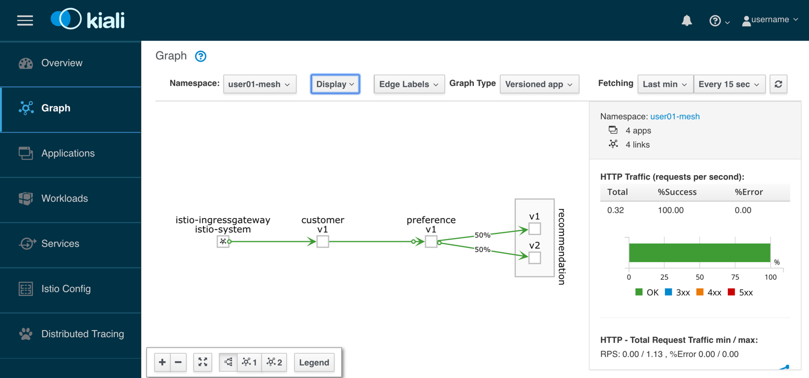

= Monitoring and Tracing
include::_attributes.adoc[]

[#monitoring]
== Monitoring

Out of the box, you get monitoring via Grafana. 

[source,bash]
----
export GRAFANA_URL=http://$(oc get route grafana -n istio-system --template='{{ .spec.host }}')
echo $GRAFANA_URL
----

using a Web Browser, navigate to $GRAFANA_URL.

Explore the available dashboards:

Istio Mesh Dashboard - Overview of the overall performance, volume, success rate of the mesh. If you click on a service, you can drill down to the Istio Service Dashboard.

Istio Service Dashboard - Detailed information about a specific service Request Volume, response code, response time, networking

Istio Performance Dashboard - Performance details of the Istio Control Plane

Generate some trafic on your customer microservice to see the results in the dashboard:

an example script is provided here to generate load:
----
cd ${LAB_HOME}
./scripts/run.sh
----

[#custommetrics]
== Custom Metrics (DEMO ONLY)

Istio also allows you to specify custom metrics which can be seen inside of the Grafana dashboard

For this workshop, this section will be done as a DEMO. We are working in a shared environment and this metric will be a common resource.

[source,bash,subs="+macros,+attributes"]
----
oc create -f https://raw.githubusercontent.com/redhat-canada/istio-tutorial/master/istiofiles/recommendation_requestcount.yml
----

The following query will be added to Prometheus
[source,bash]
----
istio_requests_total{destination_service="recommendation.user01-mesh.svc.cluster.local"}
----

[#tracing]
== Tracing

Distributed Tracing involves propagating the tracing context from service to service, usually done by sending certain incoming HTTP headers downstream to outbound requests. For services embedding a http://opentracing.io/[OpenTracing] framework instrumentations such as https://github.com/opentracing-contrib/java-spring-cloud[opentracing-spring-cloud], this might be transparent. For services that are not embedding OpenTracing libraries, this context propagation needs to be done manually.

As OpenTracing is "just" an instrumentation library, a concrete tracer is required in order to actually capture the tracing data and report it to a remote server. Our `customer` and `preference` services ship with http://jaegertracing.io/[Jaeger] as the concrete tracer. the Istio platform automatically sends collected tracing data to Jaeger, so that we are able to see a trace involving all three services, even if our `recommendation` service is not aware of OpenTracing or Jaeger at all.

Our `customer` and `preference` services are using the https://github.com/jaegertracing/jaeger-client-java/tree/master/jaeger-tracerresolver[`TracerResolver`] facility from OpenTracing, so that the concrete tracer can be loaded automatically without our code having a hard dependency on Jaeger. Given that the Jaeger tracer can be configured via environment variables, we don't need to do anything in order to get a properly configured Jaeger tracer ready and registered with OpenTracing. That said, there are cases where it's appropriate to manually configure a tracer. Refer to the Jaeger documentation for more information on how to do that.

[source,bash]
----
export JAEGER_URL=https://$(oc get routes -n istio-system jaeger-query --template='{{ .spec.host }}')
echo $JAEGER_URL
----

Using a Web Browser, navigate to the $JAEGER_URL.
In the Jaeger console, select `customer` from the list of services and `your user namespace` from the list of operation and click `Find Traces`

[#servicegraph]
== Service Graph 
Service mesh observability
Kiali is originated from the greek word κιάλι meaning monocular or spyglass.

Kiali project provides answers to the questions:
What microservices are part of my Istio service mesh and how are they connected?

In this section, you will try Kiali. 

to get the Kiali URL:

[source,bash]
----
export KIALI_URL=https://$(oc get routes -n istio-system kiali --template='{{ .spec.host }}')
echo $KIALI_URL
----

Login to the Kiali console in your Web Browser using the default username and password (do not change the values).
Kiali username: username
Kiali password: password

Once in the console, select the `Graph` tab to the left.
Select your namespace from the `Namespace` dropdown. 
Check the `Traffic animation` checkbox under the `Display` drop down.
Select `Requests percent of total` from the `Edge Label` drop down.

Generate some traffic on your customer microservice and watch the result.

You can leave the Kiali console open, it will be a useful tool to validate and visualize our changes the service mesh.

